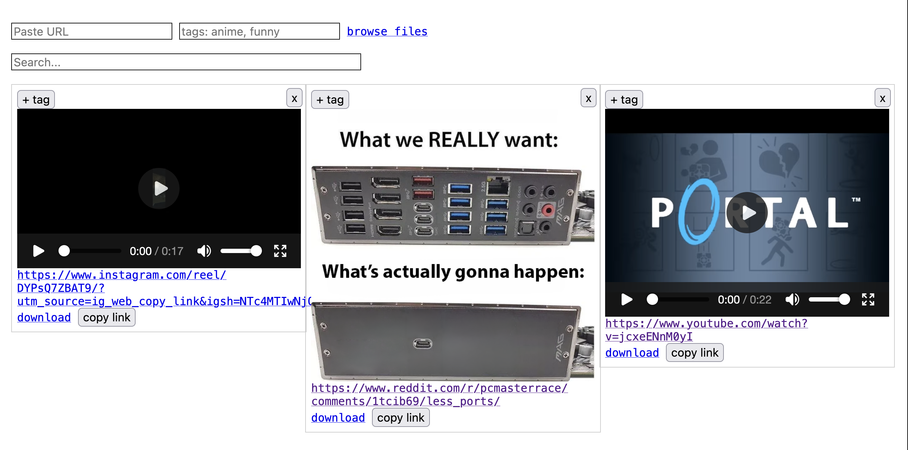

# memex

> [!NOTE]
> This project was built with significant LLM assistance under human direction and review.

Self-hosted meme library with search. Add URLs or upload files, media gets transcribed/OCR'd and indexed.



## Installation

```bash
# Install system requirements
sudo apt install tesseract-ocr ffmpeg

# Create and activate virtual environment
python3 -m venv .venv
source .venv/bin/activate

# Install dependencies
pip install -r src/requirements.txt
playwright install chromium
```

## Usage

```bash
source .venv/bin/activate
cd src/
python app.py
```

Open `http://localhost:8000`
